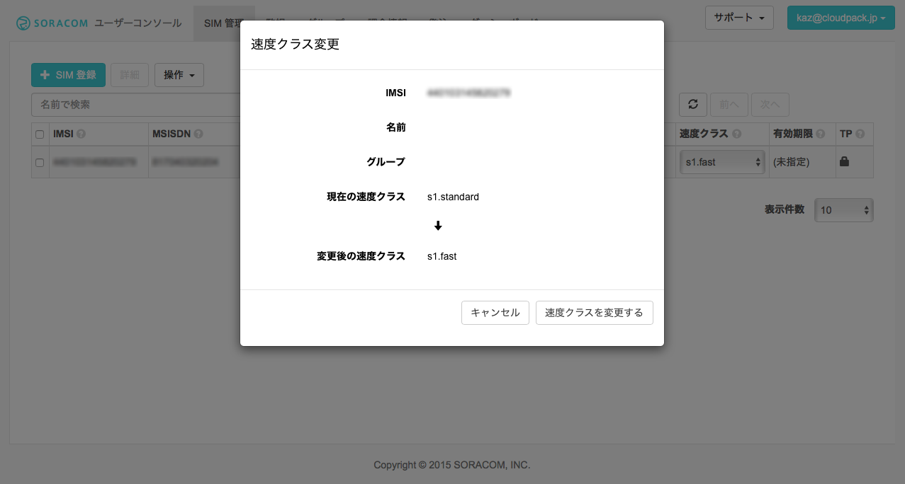

```
【執筆時メモ】
▼特集全体目次
・SORACOM Airとは
・SORACOM Airをスマホで使ってみる【←後藤担当分】
・SORACOM Airと3gドングルでラズパイでつなぐ
・データを送信する
・ほかちょっとつかってみる

▼担当記事の方向性  
・SORACOM Airが、docomo端末および、フリーシムスマホで使えることに言及していただき、その後、手元にあるスマホ端末（今販売しているものが良いです）で、設定、開通までを説明する記事
```

---

# SORACOM Airをスマートフォンで使ってみる

さて、前章で説明された通り、SORACOM AirはNTTドコモの回線を利用したデータ通信サービスを提供していますが、このSIM、実は一般のMVNO事業者が提供するSIM同様、NTTドコモ社が販売するスマートフォンはもちろんのこと、ロックがされなくSIMを自由に選択できるいわゆる **SIMフリー端末** でも利用することが可能です。

今回はSORACOM Airを利用してスマートフォンにてデータ通信を行うため、SORACOMのサービス登録からデータ通信開始までをご紹介します。


## 使い始めるまでの手順

ソラコムのウェブサイトにもありますが、通常使いはじめるまでの手順は以下のようになります。

1. Air SIMの購入
1. Air SIMの登録
1. スマートフォン端末の設定
1. データ通信利用開始


<cite>https://soracom.jp/start/</cite>

これらの手順に加えて、はじめて利用する場合はSORACOMアカウント作成が必要になります。詳しい手順については後ほどご紹介します。

では次からステップ毎に見ていきましょう。

## Air SIMの購入

まずのAir SIMの購入です。購入方法は二つの方法があり、ひとつはAmazonから、もうひとつはSORACOMユーザーコンソール（管理画面）からの購入となります。以下ではAmazonから購入する場合について説明します。

まずSIMの種類ですが、SIM種類およびSMS対応の有無によって以下の6タイプから選択します。

- Air SIM （データ通信のみ）ナノ
- Air SIM （データ通信のみ）マイクロ
- Air SIM （データ通信のみ）標準(mini)
- Air SIM （SMS 対応）ナノ
- Air SIM （SMS 対応）マイクロ
- Air SIM （SMS 対応）標準(mini)

SIMの種類は利用する端末が対応している種類（サイズ）を選びます。例えば今回使用するiPhone6では **ナノ** を使用します。またSMS機能が必要あればSMS対応版を利用しましょう。今回はSMS対応無しの **データ通信のみ** のもので説明を進めます。

購入するSIMが決まればAmazonでの購入となりますが、種類を間違えずに購入しましょう。サイズがナノでデータ通信のみであれば http://www.amazon.co.jp/dp/B015FFCZ02 から税込888円で購入できます。

  
<cite>http://www.amazon.co.jp/dp/B015FFCZ02</cite>

Air SIM購入にあたってはAmazonアカウントの作成および決済ではクレジットカードの登録が必要になります。20歳未満の利用者が購入する場合には親権者または後見人が承諾する必要があると[Amazonの利用規約][Amazonの利用規約]に書かれてます。アカウント作成および購入に当たってはご家族に確認するようにしてください。

[Amazonの利用規約]: http://www.amazon.co.jp/gp/help/customer/display.html?ie=UTF8&nodeId=643006

Amazonで決済が完了すると数日後（Prime会員の場合は最速で**当日**）に手元に届きます。


## SORACOMアカウント作成

届いたSIMを登録する前にSORACOMアカウントの作成を行います。アカウント作成するためには https://console.soracom.io/#/signup にアクセスします。


ここでは利用規約を十分読んでから `メールアドレス`、`パスワード`、`パスワード（確認）` を入力します。その際必須条件を満たすようパスワードを決定してください。


無事に作成ができるとメールアドレス確認のためにメールが送信されます。


ユーザー確認メールが届いたら、本文中にあるリンクをクリックし、登録が完了します。


登録完了すると自動的にログイン画面が表示されます。先ほど登録したメールアドレスとパスワードでログインしてください。ログイン後はすぐに支払方法を設定する必要があります。

### お支払い方法の設定


右上のメールアドレスのメニューから `お支払い方法設定` を選択して


支払い方法画面では `新しいクレジットカードを登録` をクリックします。


ただしい `カード番号`、`有効期限`、`カード名義`、`セキュリティコード` を入力して `登録` ボタンをクリックします。


入力に誤りがなければ、無事に登録が完了します。


#### 未成年でクレジットカードを持っていない場合は？

未成年でクレジットカードを持っていないとSORACOM Airの利用ができなのかというとそうでもありません。正式にはクレジットカードではありませんがVISAなどが発行するデビットカードというものであれば高校生でも作成して利用することも可能です。クレジットカードとは違い、都度引き落としがされるなど違いがあるのでご注意ください。詳しくは [Visaデビットカードのページ](http://www.visa.co.jp/personal/cards/visadebit.shtml) をご確認ください。

## Air SIMの登録

ここまできたらAmazonで購入したAir SIMを自分のSORACOMアカウントに登録しましょう。ユーザーコンソールの `SIM 管理` へ移動します。


入手したSIMカードの裏面にある `IMSI(15桁)` と `PASSCODE(5桁)` を確認しましょう。


`SIM 登録` ボタンを押し、ポップアップしたフォームへ入力します。 `名前` と `グループ` はこの時点では気にしなくても大丈夫です。複数のSIMを管理するようになった場合には適宜決めてください。


`登録` ボタンをクリックし、登録に成功すると下記のように成功した旨、メッセージが表示されます。


`終了して元の画面に戻る` ボタンをクリックするとSIM一覧が表示され、先ほど登録したSIMが登録されたことが確認できます。


### Air SIMのアクティベート（利用開始手続き）

ここまでで新しいSIMの登録が済みました。データ通信を開始するにはSIMのアクティベート（利用開始手続き）を行わなければなりません。登録済みのSIMを選択して、`操作` メニューから `使用開始` を選択しましょう。


`ステータス変更` ダイアログがポップアップするので `ステータスを変更する` ボタンをクリックして変更を適用します。


成功するとSIM一覧の画面へ戻り `1個中1個のSIMの使用を開始しました` というメッセージが表示されます。


ここまでくればSIMの利用登録が完了します。次は端末での操作になります。

## スマートフォン端末の設定

### スマートフォンにAir SIMを挿す

それでは実際にスマートフォンへSIMを入れてみましょう。入手したSIMをカードから爪を折って取り出してください。またSIMカードを取り出すためのピンを準備して下さい。

この手順ではApple Storeで購入したSIMフリーのiPhone6を使用した例をご紹介します。


ピンをiPhone6の側面にあるSIM取り出し用の穴へ差し込んでグッと押し込むとSIMカードが載っている土台が出てきます。


土台がでたら入手した新しいAir SIMを載せて、もとあった場所へ挿入します。


これでAir SIMの装着は完了です。次はAPNの設定になります。

### APN設定（プロファイルダウンロード）

APN設定をするためには https://soracom.jp/start/ へアクセスします。この段階ではまだデータ通信の利用可能になっていません。そのためWi-Fiが利用できる環境で設定を行うようにしてください。

`ステップ3 - 設定` にある `iPhone/iPad (iOS デバイス) をご利用の場合` から端末にあわせた方をダウンロードします（iOS7以降 or iOS6以前、どちらか）。


ダウンロードされるとiPhoneの `プロファイルをインストールする` 画面になります。そこで右上の `インストール` をクリックし


つづいてパスコードを入力し


`承諾` 画面で `次へ` をクリックし


さらに `警告` も確認して `インストール` をクリックすると


無事にAPNプロファイルのインストールが完了します。


#### iOS以外では

iOS以外の場合は各端末の設定で以下の設定を行います。

- APN: `soracom.io`
- ユーザ名: `sora`
- パスワード: `sora`

ここまでくれば通信設定が完了です。正常にデータ通信ができるか確認してみましょう。

## データ通信利用開始

### 端末で通信の確認

Air SIMを利用した通信の確認のためWi-Fiをオフにします。


この状態で左上のキャリア表示部分に **LTE** とあるのを確認して https://soracom.jp/ へアクセスしましょう。


正常にウェブサイトが表示されればデータ通信は正常に行われています。念のため帯域の確認もする場合は例えばNTTドコモが配布している **[ドコモスピードテスト](https://itunes.apple.com/jp/app/dokomosupidotesuto/id904856196)** アプリをダウンロードして実行してみてください。


現時点では標準タイプの **s1.standard** を利用しているため上り下り共に **0.5Mbps** 程度になるはずです。

### コンソールで通信確認

すでに端末ではデータ通信の確認ができました。ユーザーコンソールではその状況がどう見えるでしょうか。


`セッションの状態` が `オンライン` となっているはずです。この状態を見れば現在通信しているかどうかがわかるようになっています。

### コンソールで速度クラスの変更

執筆時点（2015年11月現在）ではSORACOM Airでは以下の速度クラス（帯域）が利用できます。

|速度クラス |通信速度|
|:---------:|:------:|
|s1.minimum |32kbps  |
|s1.slow    |128kbps |
|s1.standard|512kbps |
|s1.fast    |2Mbps   |

登録した時点では `s1.standard` となっているため帯域は 512kbps ですが、これを変更してみましょう。

SIM一覧の `速度クラス` のプルダウンをクリックすると4つの速度クラスが選択肢として表示されます。


ここでは `s1.fast` を選択して `速度クラスを変更する` をクリックして確定してみましょう。



変更に成功すると `速度クラスを変更しました` というメッセージが表示され速度クラスの表示が `s1.fast` に変更されます。


本当に帯域が変更された再度ドコモスピードテストアプリで確認してみましょう。


上り下り共に 2Mbps 前後が出ているを確認できました。設定後すぐに反映され、かつ安定的な通信ができるのはSORACOM Airの魅力です。定常的な利用だけでなく、夜間は帯域を制限するなど、利用者の用途にあわせて管理出来るのもウレシイですね。

ただし速度クラスに応じた料金単価設定がありますので、ご利用にあたっては予めご留意ください。不要であれば低めの速度クラスへの変更、または一旦停止されることをオススメします。

### その他SIM管理画面でできること

速度クラスの変更以外にもSIM管理では `名前` `グループ` の設定および `有効期限` の設定が可能です。

`有効期限`はその名の通り、SIMを停止する日時を設定します。この日時以降は新しいセッション（通信）を開始することができなくなります。該当のSIMの`有効期限`部分へマウスカーソルを乗せ、鉛筆マークをクリックすると `SIM 有効期限変更` ダイアログが表示されるので、日付と時刻を入力し `有効期限を変更する` ボタンをクリックして変更を確定します。


変更が成功すると `有効期限を変更しました` というメッセージが表示され `有効期限` が指定した日時へ変更されているのが確認できます。


このようにして、あらかじめ期限を切ったデータ通信利用設定をユーザーコンソール上で指定することが可能です。

ちなみに期限を削除するには変更時と同様 `SIM 有効期限変更` ダイアログで `有効期限をクリア` ボタンをクリックしてください。

## まとめ

さてここまでAir SIMを入手して、実際にスマートフォンでデータ通信をするまでの手順をご紹介しましたが、いかがでしたでしょうか？

実際にやってみると思っていた以上に簡単で、あっけなくデータ通信の利用がスタートできてしまうと思います。そしてSIMの利用開始・停止、そして帯域の設定など、これまで通信キャリアに依存していて容易に変更出来なかった部分が、いかに簡単にそして自由にコントロールできるかをご理解して頂けたかと思います。

もしお手持ちのSIMフリー端末やWi-FiルーターなどありましたらAir SIMを利用してみてください。初期費用も数百円から、わかりやすい従量課金体系。データ容量制限もなく、帯域も自由にコントロールできるIoT時代のデータ通信体験をぜひ体験してみてください。
